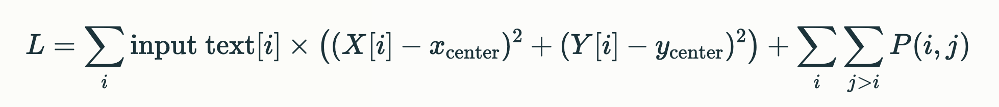

# Bashikeyboard
## I will (attempt to) design an algorithm to compute the optimal domain specific keyboard layout
- Currently I am utilizing gradient descent to iteratively generate layouts
- I essentially take the counts of each of 47 predetermined characters in some file and order the counts based on ascii value (based on the character they correspond to)
- I then initialize random x and y positions for each of the 47 keys (that correspond to the 47 length charcount vector)
- The objective function is defined as the dot product of the vector of distances of each key (x, y) from the center of all keys and the vector of character counts for some file
- An additional penalty term is added onto the purely distance based objective function defined above designed to prevent key overlaps
- The penalty for any one overlap is calculated as the product of an arbitrary predefined penalty constant and the squared difference between the overlap distance and the predefined minimum distance

### Objective Function:

### Penalty Term:

### Euclidean Distance

## System Design Diagram

